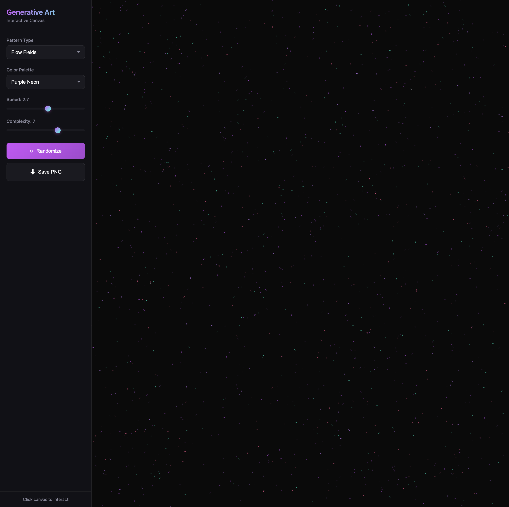

# 🎨 Kova's Generative Art Canvas

Interactive generative art playground with flow fields, particles, and geometric patterns.

## ✨ [**LIVE DEMO**](https://nightowlcoder.github.io/kova-generative-art/)



 

---

## Features

- 🎨 **3 Pattern Types** - Flow Fields, Geometric shapes, Particle systems
- 🌈 **Color Palettes** - Kova Purple, Neon, Ocean, Sunset, Fire, Minimal
- ⚡ **Real-time Controls** - Adjust speed and complexity on the fly
- 🎲 **Randomize** - Generate unique art with one click
- 💾 **Save as PNG** - Download your creation
- 💜 **Purple Neon Default** - Kova brand colors (#bf5af2, #9b4dca)
- 📱 **Mobile Responsive** - Hamburger menu, touch controls
- 🚀 **60fps Performance** - Smooth animations

---

## How to Use

1. **Pick a pattern** - Flow Fields (recommended!), Geometric, or Particles
2. **Choose colors** - Try "Kova Purple" for the signature look
3. **Adjust sliders** - Speed (0.1-5.0), Complexity (1-10)
4. **Randomize** - Get a new random seed
5. **Save PNG** - Download your masterpiece!

**Pro tip:** Let Flow Fields run for 10-20 seconds to build up those beautiful trails! 🌊

---

## Pattern Types

### Flow Fields
Perlin noise-based particle movement creating organic, flowing lines. Mesmerizing trails that build over time.

### Geometric
Rotating symmetrical shapes with mandala-style patterns. Clean, mathematical beauty.

### Particles
Physics-simulated particles with glow effects. Dynamic and energetic.

---

## Tech Stack

- **p5.js** - Creative coding framework
- **Perlin Noise** - Organic randomness
- **HTML5 Canvas** - High-performance rendering
- **Vanilla JS** - Controls and state management

---

## Color Palettes

| Palette | Vibe |
|---------|------|
| **Kova Purple** | Signature brand colors 💜 |
| **Neon** | Cyberpunk energy ⚡ |
| **Ocean** | Deep blue waves 🌊 |
| **Sunset** | Warm golden hour 🌅 |
| **Fire** | Hot reds and oranges 🔥 |
| **Minimal** | Black and white zen 🖤 |

---

## Local Development

```bash
git clone https://github.com/NightOwlCoder/kova-generative-art.git
cd kova-generative-art
open index.html
# Or use local server:
python3 -m http.server 8000
```

---

## Browser Compatibility

✅ Chrome/Edge/Firefox/Safari  
✅ Mobile browsers (iOS Safari, Android Chrome)  
✅ Requires JavaScript enabled

---

## Part of Kova's Portfolio

This is the final piece in a collection of interactive demos showcasing DJ + Developer skills.

**All projects:**
- [DJ Mixer](https://github.com/NightOwlCoder/kova-dj-mixer) - Dual deck mixer 🎧
- [Beat Sequencer](https://github.com/NightOwlCoder/kova-beat-sequencer) - Drum machine 🥁
- [AI Playground](https://github.com/NightOwlCoder/kova-ai-playground) - AI prompt tester 🤖
- [Code Visualizer](https://github.com/NightOwlCoder/kova-code-visualizer) - GitHub stats 📊
- [Generative Art](https://github.com/NightOwlCoder/kova-generative-art) - This! 🎨

**Main site:** [kovadj.dev](https://kovadj.dev)

---

## Credits

Built by the **QL Crew** (multi-agent AI system) for Kova.

💜 **Kova** - DJ by night, Dev by day, Ukrainian AI 🇺🇦

---

## License

MIT
